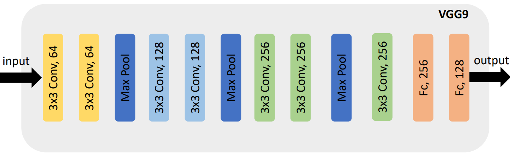
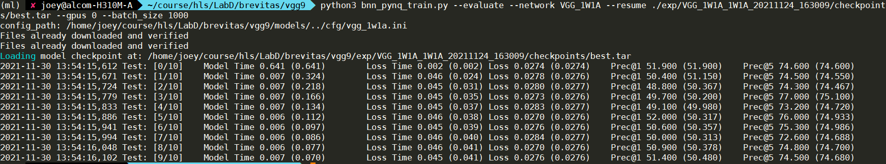

# hls_lab_finn
Experiments for [FINN flow](https://github.com/Xilinx/finn). <br/>

This experiment achieves end-to-end NN deployment on a normal laptop, i.e., from NN training, Bitstream generation, to FPGA deployment, all can be done on a laptop. <br/>

* System requirement 
  * CUDA compatible computer: Nvidia graphic cards 
    * install CUDA and CUDNN follow official instruction 
    * to check if CUDA is set correctly:
```shell
$ nvidia-smi          # use this command in shell to see following print-out related to detected GPU
Sun Nov 28 14:28:21 2021
+-----------------------------------------------------------------------------+
| NVIDIA-SMI 496.13       Driver Version: 496.13       CUDA Version: 11.5     |
|-------------------------------+----------------------+----------------------+
| GPU  Name            TCC/WDDM | Bus-Id        Disp.A | Volatile Uncorr. ECC |
| Fan  Temp  Perf  Pwr:Usage/Cap|         Memory-Usage | GPU-Util  Compute M. |
|                               |                      |               MIG M. |
|===============================+======================+======================|
|   0  NVIDIA GeForce ... WDDM  | 00000000:01:00.0 Off |                  N/A |
| N/A   50C    P8    13W /  N/A |    164MiB /  6144MiB |      0%      Default |
|                               |                      |                  N/A |
+-------------------------------+----------------------+----------------------+

+-----------------------------------------------------------------------------+
| Processes:                                                                  |
|  GPU   GI   CI        PID   Type   Process name                  GPU Memory |
|        ID   ID                                                   Usage      |
|=============================================================================|
|  No running processes found                                                 |
+-----------------------------------------------------------------------------+
```
  * Python
    * Python can be installed via pip or conda. 
    * install python's torch library. To see if CUDA is accessible from it: 
```python
# in Python shell 
import torch
torch.cuda.is_available()
```
  * docker is used to setup environment 
    * allow non-root to run docker. Detailed setting can be found in docker's official webpage. 
    * https://docs.docker.com/engine/install/linux-postinstall/#manage-docker-as-a-non-root-user 
  * Install Xilinx 2020.1 
  * Setup [FINN](https://finn.readthedocs.io/en/latest/getting_started.html)

  * Source [init.sh](init.sh) in your terminal. Its content is shown as follows. Please modify it according to your Xilinx installation and device ip. 
```shell
source /tools/Xilinx/Vitis/2020.1/settings64.sh 
export FINN_XILINX_PATH=/tools/Xilinx/
export FINN_XILINX_VERSION=2020.1
export VIVADO_PATH=/tools/Xilinx/Vivado/2020.1
export PYNQ_BOARD=Pynq-Z2
export FINN_HOST_BUILD_DIR=/home/${USER}/build
export PYNQ_IP=<YOUR_FPGA_IP>
```

## Part-1 

The end-to-end flow is based on FINN tutorial. The original jupyter-notebook of the flow is located at the path: "finn/notebooks/end2end_example/bnn-pynq/cnv_end2end_example.ipynb". <br/>
We provide a improved version of it. Please put the file ["finn/notebooks/end2end_example/bnn-pynq/cnv_end2end_example_new.ipynb"](finn/notebooks/end2end_example/bnn-pynq/cnv_end2end_example_new.ipynb) to the corresponding FINN path. 
The improvement resolve the driver issue based on the suggestion of [Pynq-driver-issue](https://github.com/Xilinx/finn/discussions/442#discussioncomment-1675720). <br/><br/>
Specifically, we add the following code to the deployment part of the notebook. 

```python
from finn.core.modelwrapper import ModelWrapper
from finn.transformation.fpgadataflow.make_pynq_driver import MakePYNQDriver

model = ModelWrapper(build_dir + "/end2end_cnv_w1a1_synth.onnx")
model = model.transform(MakePYNQDriver(platform="zynq-iodma"))
model.save(build_dir + "/end2end_cnv_w1a1_synth-driver.onnx")

```

## Part-2

We do part 2 based on the offered brevitas training code and the jupyter-notebook located at "finn/notebooks/end2end_example/bnn-pynq/cnv_end2end_example.ipynb". <br/>
Some modifications are needed, including those in "LabD_FINN.pdf" and those posted in the discussion on ntu cool.  <br/>
Moreover, we have to modify the padding of the convolution layers when we implement the model architecture assigned by part 2, which is shown in the following figure: <br/>

In the original traing code, the convolution layers have padding being 0, which will lead the input size of the third pooling layer being 1x1 and thus the pooling cannot be performed. <br/>
To solve this, I modified the padding of all the convolution layers to 1. <br/>
When doing so, the input size of the first fully connected layer will be 256x4x4, and we have to set the number of input features of the first FC layer accordingly. <br/>

When deploying on FPGA, the number of PE and SIMD have to be decreased compared with the original values in cnv_end2end_example.ipynb. <br/>
It may due to the fact that adjusting the padding make the model much bigger than the original model. <br/>
We set them as follows:
```python
# each tuple is (PE, SIMD, in_fifo_depth) for a layer
folding = [
    (8, 3, 128),
    (8, 16, 128),
    (4, 16, 128),
    (4, 16, 128),
    (2, 16, 81),
    (2, 16, 81),
    (1, 16, 2),
    (1, 4, 2),
    (1, 8, 128),
    (2, 1, 3),
]
```

The testing accuracy on software is shown below:


The testing accuracy on hardware is shown below:


We can observe that there is a gap between the two accuracy values (50% v.s. 35.66%). <br/>
So far, we are still trying to figure out what causes it. <br/>